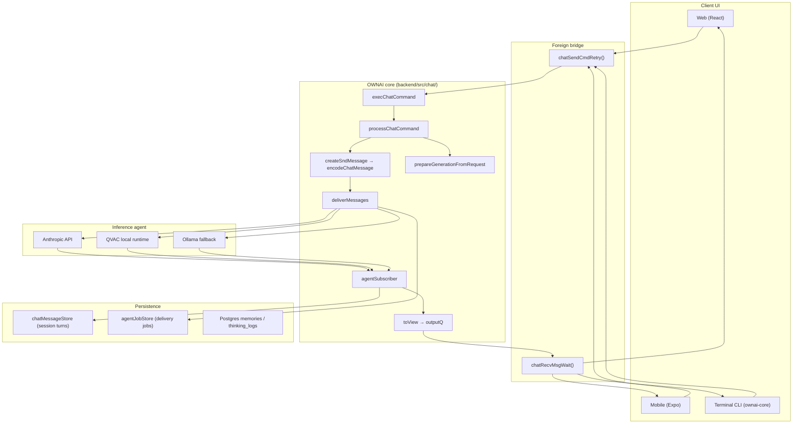

# OWNAI Chat Pipeline Architecture

OWNAI uses a **SimpleX-inspired layered pipeline** for chat send/receive. All clients (web, mobile, CLI) go through a **foreign bridge** into a shared **core**, which delivers to an **inference agent**, persists to **storage**, and streams results via an **output queue**.



## Layer map

| SimpleX concept | OWNAI implementation |
|-----------------|----------------------|
| `chatSendCmdRetry` | `frontend/src/bridge/chatBridge.js`, `ownai-core/src/bridge/chat-bridge.js` |
| `chatRecvMsgWait` | SSE consumer on stream response or `GET /api/v1/chat-bridge/receive/:correlationId` |
| `execChatCommand` | `backend/src/chat/core/execChatCommand.js` |
| `processChatCommand` | `backend/src/chat/core/processChatCommand.js` |
| `deliverMessages` | `backend/src/chat/agent/deliverMessages.js` |
| `agentSubscriber` | `backend/src/chat/agent/agentSubscriber.js` |
| `outputQ` | `backend/src/chat/bridge/outputQueue.js` |
| Chat DB | `backend/src/chat/storage/chatMessageStore.js` + Postgres `memories` |
| Agent DB | `backend/src/chat/storage/agentJobStore.js` |

## HTTP endpoints

| Endpoint | Role |
|----------|------|
| `POST /api/v1/chat-bridge/command` | Bridge entry — `send_message`, `ping` |
| `GET /api/v1/chat-bridge/receive/:correlationId` | Decoupled receive from outputQ |
| `POST /api/v1/generate` | Legacy alias → same core pipeline |
| `POST /api/v1/chat` | Legacy alias → same core pipeline |

## Client usage

### Web (React)

```javascript
import { chatSendMessage, chatRecvMsgWait } from './bridge/chatBridge.js';

const response = await chatSendMessage({ prompt: 'Hello', stream: true }, { sessionId });
const result = await chatRecvMsgWait(response, { onText: (t) => console.log(t) });
```

### CLI

```javascript
import { ChatBridge } from 'ownai-core';

const bridge = new ChatBridge('https://ownai-6pc9.onrender.com');
const result = await bridge.chat('Summarize my PDF', { onToken: console.log });
```

### Mobile

`mobile/src/api/client.ts` uses `POST /api/v1/chat-bridge/command` for online inference.

## Command types

- **`send_message`** — RAG + memory + inference (streaming or JSON)
- **`ping`** — health check for bridge connectivity

## Notes

- Thinking modes (`/api/v1/think`) and attachments still use dedicated routes; they can be migrated to core commands later.
- OpenAI-compatible `/v1/chat/completions` remains a separate shim for external tools.
